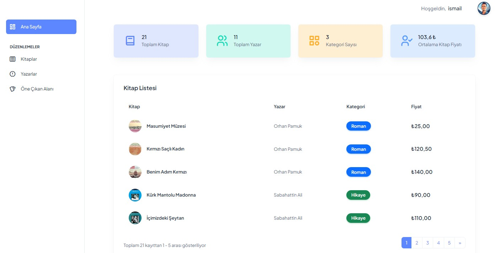
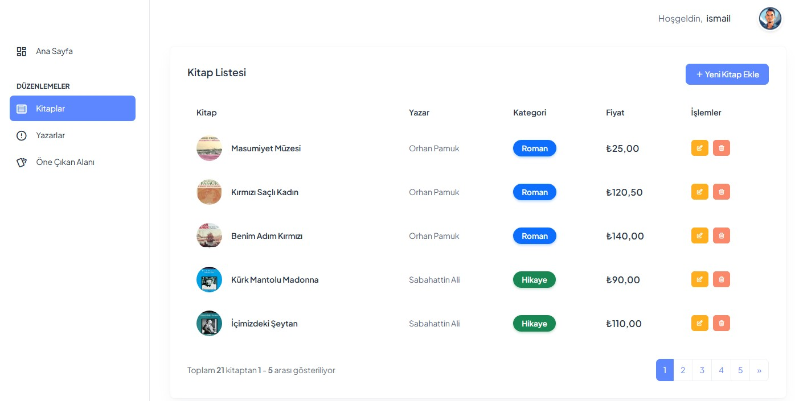
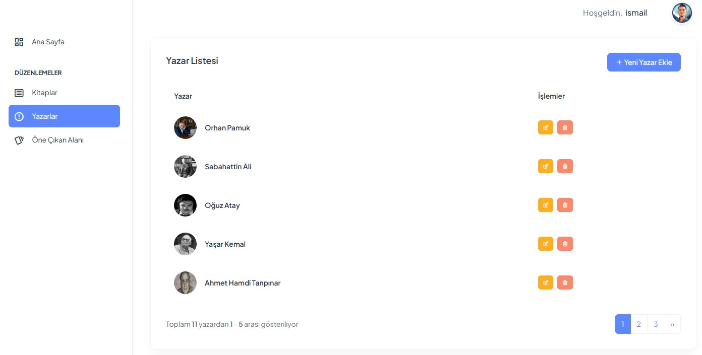
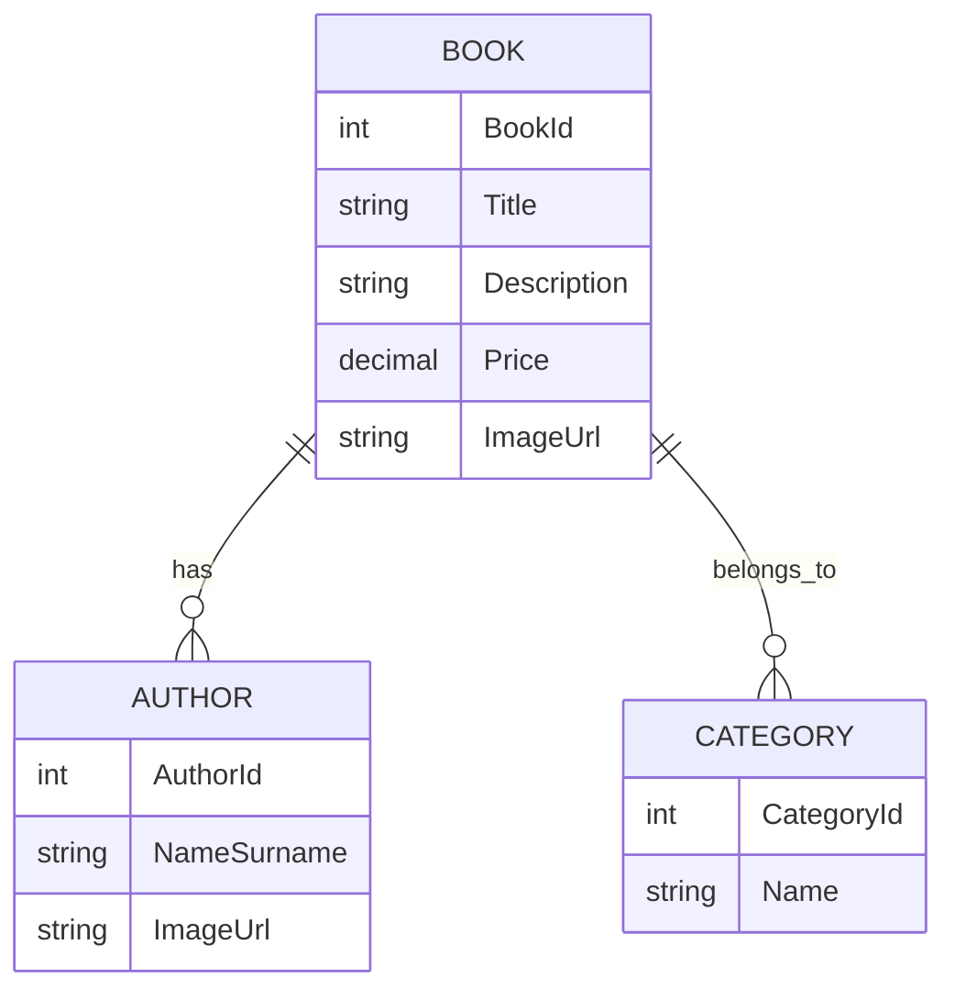

# 📚 MyApiNightCase - Kitap Yönetim Sistemi

<div align="center">
  
</div>

## 🌟 Proje Hakkında

MyApiNightCase, modern web teknolojileri kullanılarak geliştirilmiş kapsamlı bir kitap yönetim sistemidir. Bu proje, kitapların, yazarların ve özelliklerin yönetimini kolaylaştırmak için tasarlanmış kullanıcı dostu bir arayüz sunar.

## 🚀 Özellikler

- 📖 Kitap Yönetimi (CRUD İşlemleri)
- 👥 Yazar Yönetimi
- 🎯 Öne Çıkan Özellikler
- 📱 Responsive Tasarım
- 🔒 Güvenli Kimlik Doğrulama
- 📊 Sayfalama ve Filtreleme

## 💻 Kullanılan Teknolojiler

### Backend
- **.NET 6.0**: Ana framework
- **Entity Framework Core**: ORM aracı
- **API**: Web servisleri
- **Swagger**: API dokümantasyonu

### Frontend
- **ASP.NET Core MVC**: Web arayüzü
- **Bootstrap 5**: Responsive tasarım
- **jQuery**: DOM manipülasyonu
- **SweetAlert2**: Modern bildirimler
- **AJAX**: Asenkron veri iletişimi

## 🏗️ Mimari Yapı

Proje, N-Tier (Çok Katmanlı) mimari kullanılarak geliştirilmiştir:

```
MyApiNightCase/
├── MyApiNightCase.EntityLayer/     # Veritabanı modelleri
├── MyApiNightCase.DataAccessLayer/ # Veritabanı işlemleri
├── MyApiNightCase.BusinessLayer/   # İş mantığı
├── MyApiNightCase.WebApi/         # API katmanı
└── MyApiNightCase.WebUI/          # Kullanıcı arayüzü
```

## 🖼️ Arayüz Görüntüleri

### Kitap Listesi
<div align="center">
  
</div>

### Yazar Yönetimi
<div align="center">
  
</div>

## 🛠️ Kurulum

1. Repoyu klonlayın:
```bash
git clone https://github.com/ismailbarankarasu/MyApiNightCase.git
```

2. Veritabanını oluşturun:
```bash
Update-Database
```

3. API projesini başlatın:
```bash
cd MyApiNightCase.WebApi
dotnet run
```

4. Web UI projesini başlatın:
```bash
cd MyApiNightCase.WebUI
dotnet run
```

## 🔐 API Endpoints

### Kitaplar
- `GET /api/Book` - Tüm kitapları listele
- `POST /api/Book/CreateBook` - Yeni kitap ekle
- `PUT /api/Book/UpdateBook` - Kitap güncelle
- `DELETE /api/Book/DeleteBook/{id}` - Kitap sil

### Yazarlar
- `GET /api/Author` - Tüm yazarları listele
- `POST /api/Author/CreateAuthor` - Yeni yazar ekle
- `PUT /api/Author/UpdateAuthor` - Yazar güncelle
- `DELETE /api/Author/DeleteAuthor` - Yazar sil

## 📊 Veritabanı Şeması



## 🤝 Katkıda Bulunma

1. Fork'layın
2. Feature branch oluşturun (`git checkout -b feature/amazing-feature`)
3. Commit'leyin (`git commit -m 'feat: Add amazing feature'`)
4. Push'layın (`git push origin feature/amazing-feature`)
5. Pull Request açın


## 👥 İletişim

İsmail Karasu - [ismailbaran04@gmail.com](ismailbaran04@gmail.com)

Proje Linki: [https://github.com/ismailbarankarasu/MyApiNightCase](https://github.com/ismailbarankarasu/MyApiNightCase)
